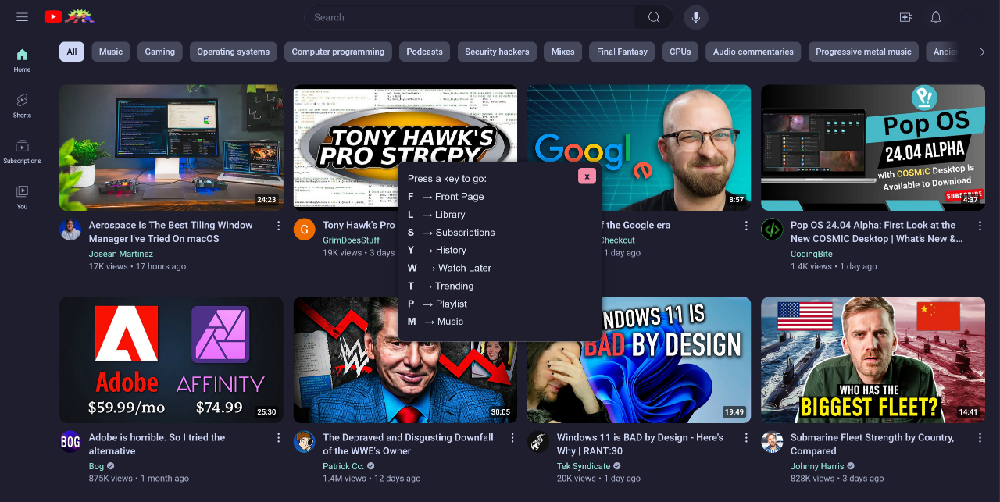

# KeyJump Userscript

## Overview

**KeyJump** is a userscript that enhances your browsing experience by adding a convenient keybinding menu. This menu allows you to quickly navigate through various sections of supported websites using just your keyboard, making it easier and faster to access your favorite content.

## Screenshot

Here's a preview of the KeyJump keybinding menu in action:

## Features

- **Keybinding Menu:** Displays a customizable menu with keybindings for various sections of the website.
- **Quick Navigation:** Use simple keyboard shortcuts to jump directly to different pages on these websites.

## Supported Websites

- **YouTube**
- **Last.fm**

## Installation

**Userscript**: Install [Violentmonkey](https://violentmonkey.github.io/) or [Tampermonkey](https://tampermonkey.net/), then **[click here to install keyjump](https://update.greasyfork.org/scripts/503298/KeyJump.user.js)**.

## Usage

### How to Open the Menu

- Press the `G` key to toggle the keybinding menu on or off.

### Important Reminder

- Make sure to replace `'YourUsername'` in the script with your actual Last.fm username to personalize the Last.fm keybindings.

## License

This project is licensed under the GPL-3.0 License.

## Author

- **Megane0103** - [GitHub](https://github.com/Megane0103/keyjump)